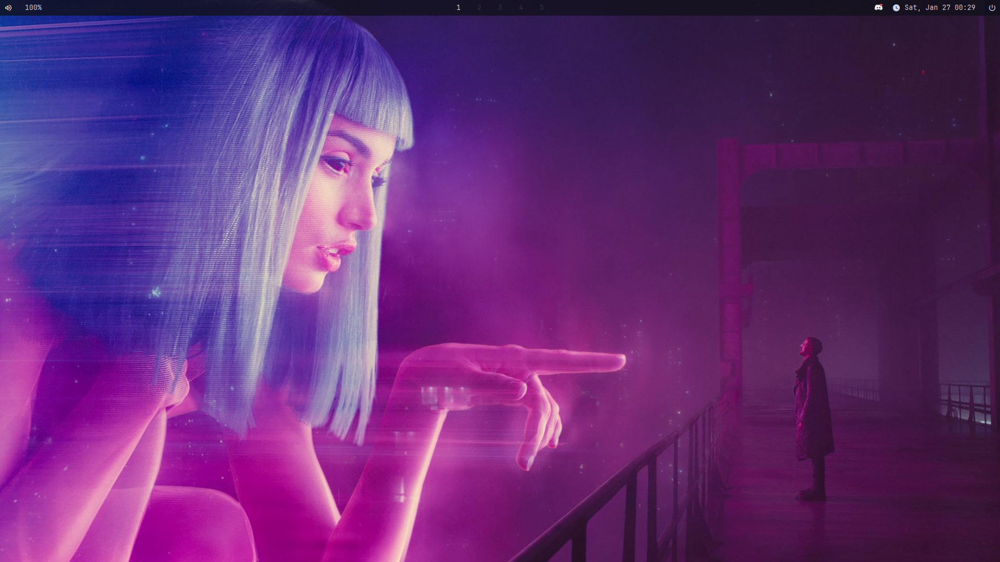
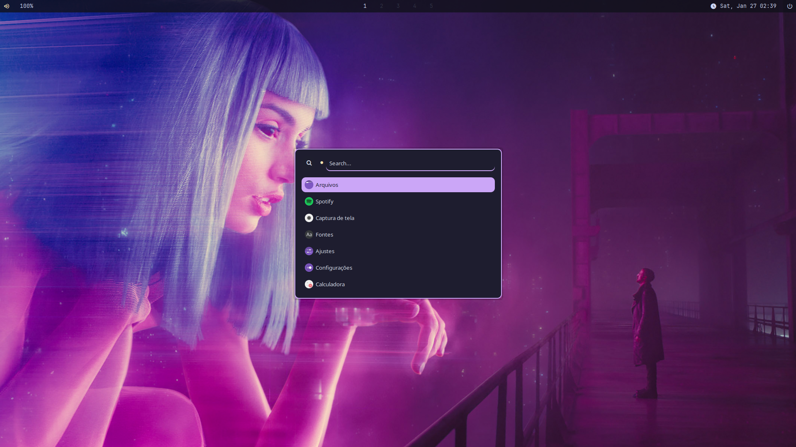
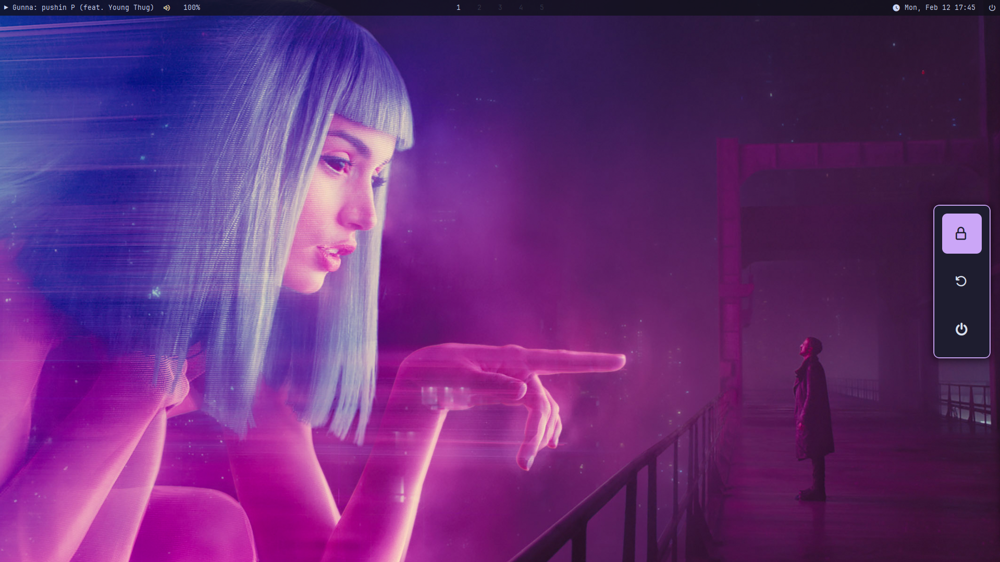
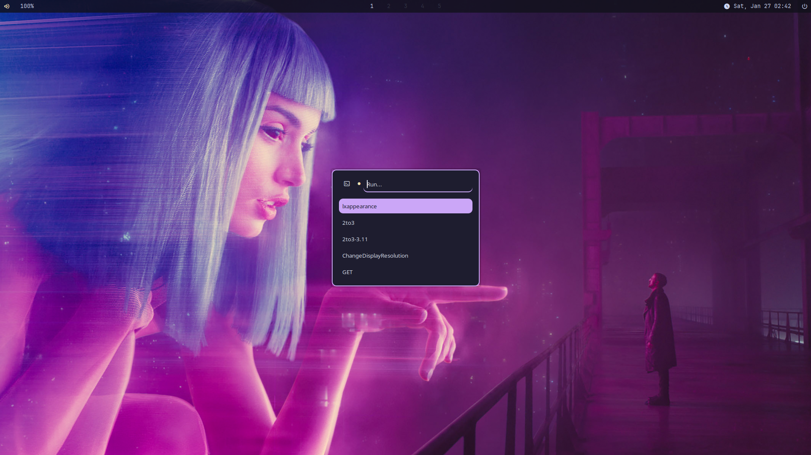
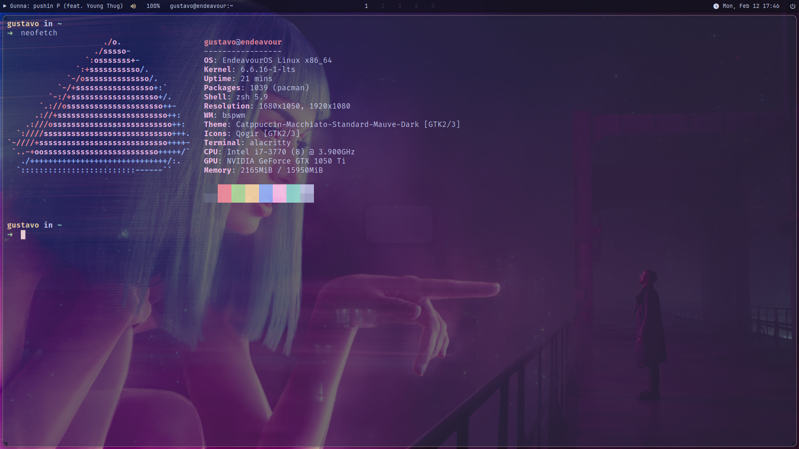

# dotfiles

## Install
```
$ yay -S xorg xorg-xinit alacritty bspwm sxhkd nitrogen rofi numlockx dunst polybar betterlockscreen neovim zsh
```

For picom, install the [pijulius' picom fork](https://github.com/pijulius/picom)

Once you have all the dependencies installed, clone the repository and just copy the files to your home directory.

## Previews
<details>
<summary>Clean screen</summary>

</details>

<details>
<summary>Rofi Launcher</summary>

</details>

<details>
<summary>Rofi Power Menu</summary>

</details>

<details>
<summary>Rofi Run Menu</summary>

</details>

<details>
<summary>Neofetch</summary>

</details>

## Zsh

[Zsh theme](https://github.com/spaceship-prompt/spaceship-prompt)

and at the end of the .zshrc file, add the following lines:

```
SPACESHIP_PROMPT_ORDER=(
  user          # Username section
  dir           # Current directory section
  host          # Hostname section
  git           # Git section (git_branch + git_status)
  hg            # Mercurial section (hg_branch  + hg_status)
  exec_time     # Execution time
  line_sep      # Line break
  jobs          # Background jobs indicator
  exit_code     # Exit code section
  char          # Prompt character
)
SPACESHIP_USER_SHOW=always
SPACESHIP_PROMPT_ADD_NEWLINE=false
SPACESHIP_CHAR_SYMBOL="❯"
SPACESHIP_CHAR_SUFFIX=" "
```

### Credits
Pretty much every color scheme is from [catppuccin](https://github.com/catppuccin). Polybar design is from [ericmurphyxyz](https://github.com/ericmurphyxyz/dotfiles), modified for my needs. Rofi theme is from [catppuccin](https://github.com/catppuccin/rofi/tree/main/deathemonic) too, modified to combine with the polybar theme and because some icons are broken. The wallpaper is from [here](https://www.reddit.com/r/wallpaper/comments/crmlwi/you_look_lonely_1920_x_1080/). For the picom config, I used (Spaxly's config)[https://github.com/Spaxly/dotfiles/tree/main].

### Warning
These are my personal dotfiles. It is strongly advised not to use them unless you understand their functionalities. Additionally, it is not recommended to use them if you lack the knowledge to troubleshoot potential issues. I cannot be held responsible for any damage they may cause to your system.